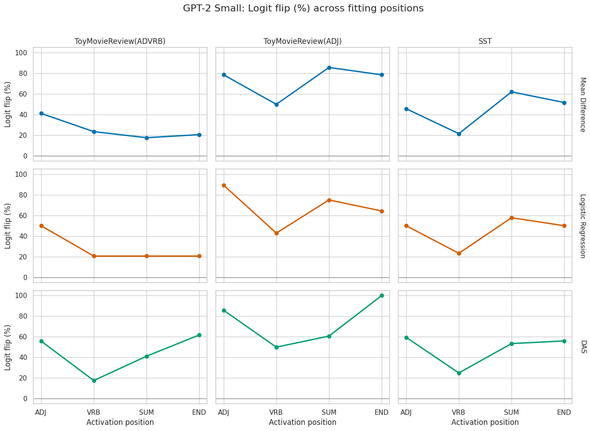
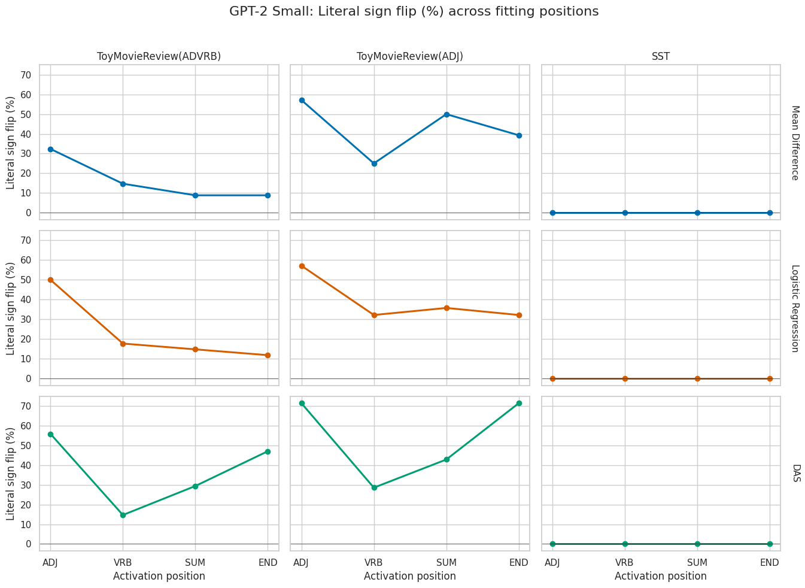
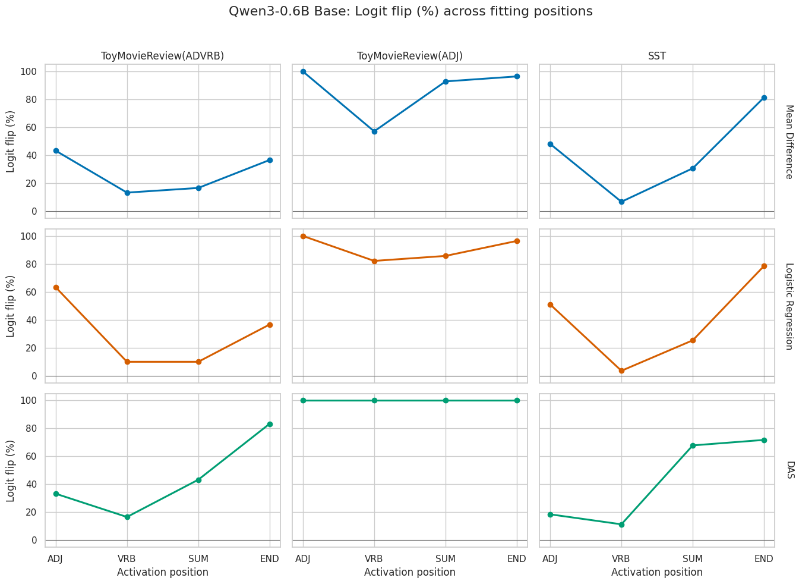
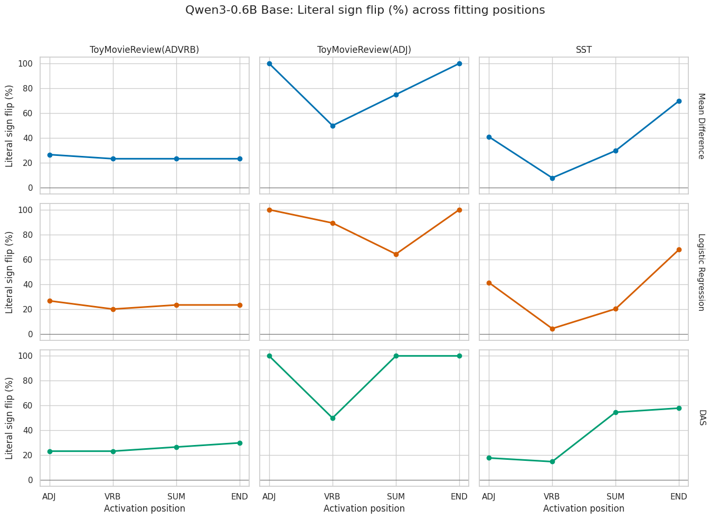

## Research question 1: How does token position used for learning sentiment directions affect predictive performance
What motivates this question is the work of Tigges et al. that showed the phenonomenon of `sentiment summarization`. This gives the ability of the model to concentrate attention on punctuations like comma, fullstop and nouns and the last token. This therefore made us ask if there is variability in predictive performance when we learn directions on activations at different token positions of the input prompts.

### Datasets and methodology
We used the same ToyMovieReview datasets used in Tigges et al. and then learn directions on 3 linear methods such as mean difference, logistic regression, and distributed alignment search(DAS) across 4 different positions, adjective(ADJ), verb(VRB), `second` movie(SUM), and last(END) token. We train all directions on ADJ token, select the best direction checkpoints and layers based on loss performance and logit flip accuracy on ToyMovieReview ADVERB validation datasets for each fitting method and token positions. Ultimately, the best layer directions on the validation datasets are then evaluated on one out-of-distribution dataset, SST.

In addition to the logit flip accuracy, we introduced a new acuuracy metric called the `literal sign flip` accuracy metric. This helps us to quantify how much of the data samples cross zero in either directions(positive and negative).

### Results and Analysis

#### GPT-2 Small & Qwen3-0.6b model
For SST, In gpt-2-small, we observe that there is no clear winner between the SUM and END token across the 3 fitting methods. It's also important to mention that all token positions have zero accuracy for the `sign flip` metric, our more restrictive accuracy metric.

However, in qwen-0.6b, it becomes really apparent that the END token performs better across all fitting methods and the two metrics. Here, the END token gives high non-zero performance on our new metric, `sign flip` accuracy between 50-85% across all methods. This thereby suggests that the last token positions encode a rich information about sentiment due to having more information about context of the samples.

*Figure 1. GPT-2 Small logit-flip performance across activation positions. Rows correspond to Mean
Difference, Logistic Regression, and DAS; columns correspond to ToyMovieReview ADVRB,
ToyMovieReview ADJ, and SST. Each point is evaluated using the layer selected by ADVRB
`logit_flip_percent` for that fitting-method and activation-position combination.*

*Figure 2. GPT-2 Small literal sign-flip performance at the same frozen ADVRB-selected layers used
in Figure 1. The metric measures the percentage of counterfactual interventions whose patched
logit difference crosses zero in the target sentiment direction.*

*Figure 3. Qwen3-0.6B Base logit-flip performance across activation positions. Rows correspond to
Mean Difference, Logistic Regression, and DAS; columns correspond to ToyMovieReview ADVRB,
ToyMovieReview ADJ, and SST. Each point is evaluated using the layer selected by ADVRB
`logit_flip_percent` for that fitting-method and activation-position combination.*

*Figure 4. Qwen3-0.6B Base literal sign-flip performance at the same frozen ADVRB-selected layers
used in Figure 3. The ADVRB panels are selection-set results, while the ADJ and SST panels report
performance after the selected layers have been frozen.*
