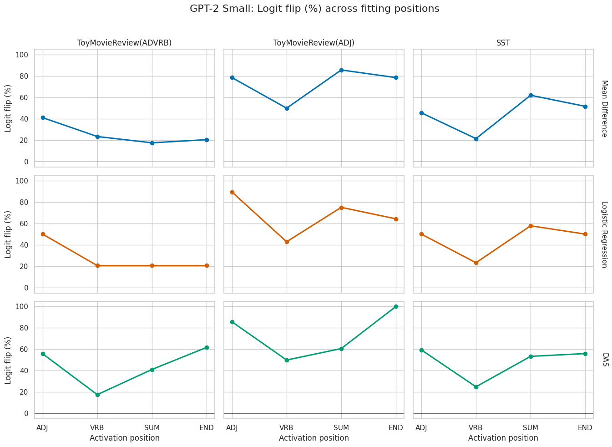
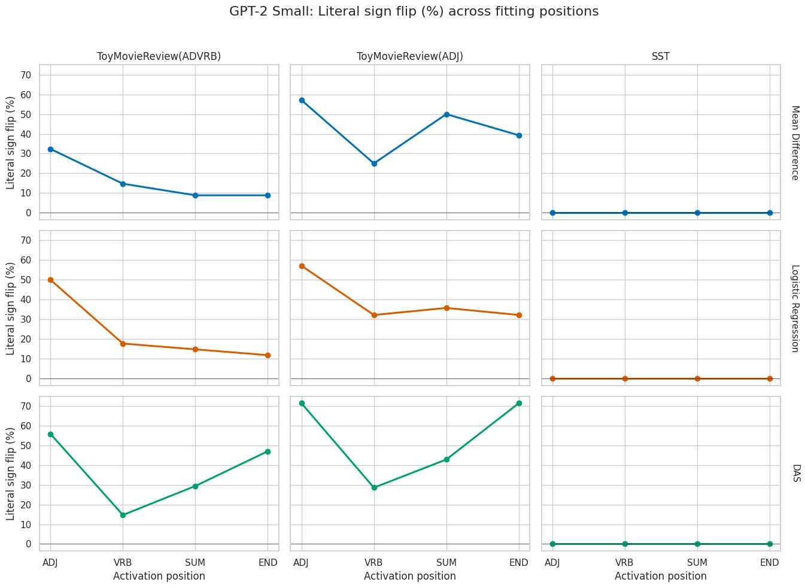
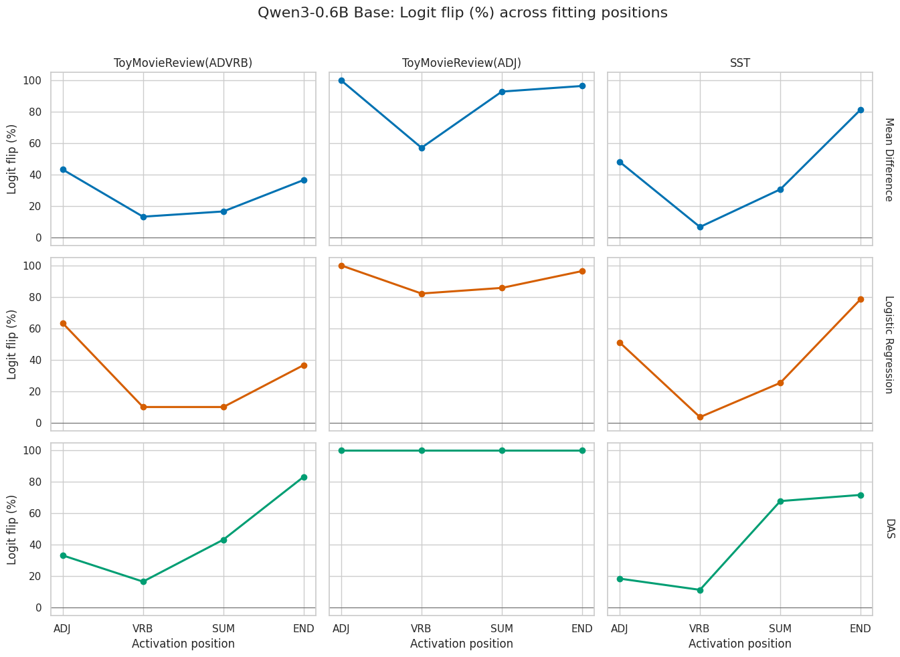
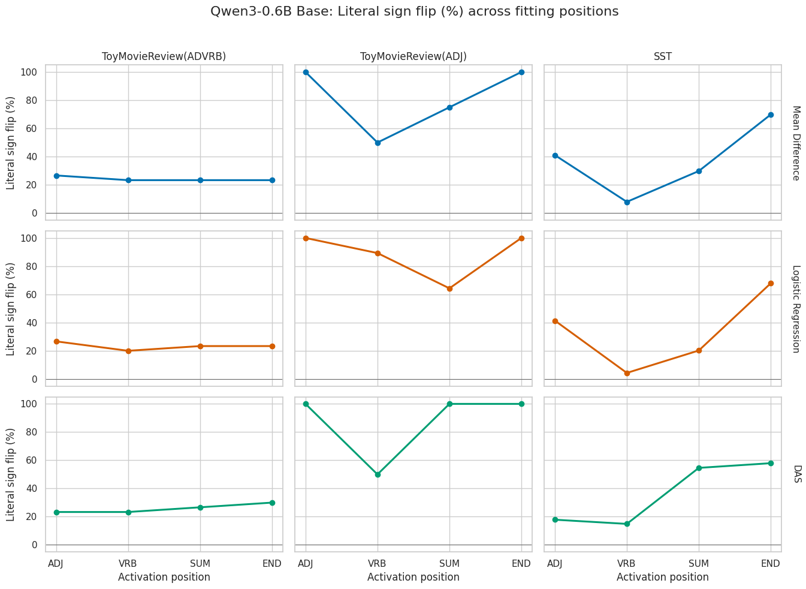

## Research question 1: How does token position used for learning sentiment directions affect predictive performance
What motivates this question is the work of Tigges et al. that showed the phenonomenon of `sentiment summarization`. This gives the ability of the model to concentrate attention on punctuations like comma, fullstop and nouns and the last token. This therefore made us ask if there is variability in predictive performance when we learn directions on activations at different token positions of the input prompts.

### Datasets and methodology
We used the same ToyMovieReview datasets used in Tigges et al. and then learn directions on 3 linear methods such as mean difference, logistic regression, and distributed alignment search(DAS) across 4 different positions, adjective(ADJ), verb(VRB), `second` movie(SUM), and last(END) token. We train all directions on ADJ token, select the best direction checkpoints and layers based on loss performance and logit flip accuracy on ToyMovieReview ADVERB validation datasets for each fitting method and token positions. Ultimately, the best layer directions on the validation datasets are then evaluated on one out-of-distribution dataset, SST.

In addition to the logit flip accuracy, we introduced a new acuuracy metric called the `literal sign flip` accuracy metric. This helps us to quantify how much of the data samples cross zero in either directions(positive and negative).

### Results and Analysis

#### GPT-2 Small & Qwen3-0.6b model
For SST, In gpt-2-small, we observe that there is no clear winner between the SUM and END token across the 3 fitting methods. It's also important to mention that all token positions have zero accuracy for the `sign flip` metric, our more restrictive accuracy metric.

However, in qwen-0.6b, it becomes really apparent that the END token performs better across all fitting methods and the two metrics. Here, the END token gives high non-zero performance on our new metric, `sign flip` accuracy between 50-85% across all methods. This thereby suggests that the last token positions encode a rich information about sentiment due to having more information about context of the samples.

*Figure 1. GPT-2 Small logit-flip performance across activation positions. Rows correspond to Mean
Difference, Logistic Regression, and DAS; columns correspond to ToyMovieReview ADVRB,
ToyMovieReview ADJ, and SST. Each point is evaluated using the layer selected by ADVRB
`logit_flip_percent` for that fitting-method and activation-position combination.*

*Figure 2. GPT-2 Small literal sign-flip performance at the same frozen ADVRB-selected layers used
in Figure 1. The metric measures the percentage of counterfactual interventions whose patched
logit difference crosses zero in the target sentiment direction.*

*Figure 3. Qwen3-0.6B Base logit-flip performance across activation positions. Rows correspond to
Mean Difference, Logistic Regression, and DAS; columns correspond to ToyMovieReview ADVRB,
ToyMovieReview ADJ, and SST. Each point is evaluated using the layer selected by ADVRB
`logit_flip_percent` for that fitting-method and activation-position combination.*

*Figure 4. Qwen3-0.6B Base literal sign-flip performance at the same frozen ADVRB-selected layers
used in Figure 3. The ADVRB panels are selection-set results, while the ADJ and SST panels report
performance after the selected layers have been frozen.*

## Research question 2: Is there a universal sentiment direction?
- Plan
    - Brief reason for asking question? 
    - Datasets and methodology
    - Results and analysis. Here we just focus mostly on sign flip accuracy of the 2 models and 2 methods(mean difference and DAS). Show how they perform on external datasets. Second, we report geometrical alignment both within datasets and cross-dataset.

In Tigges et al., a single direction in the activation space of a model was shown to have generalize to several OOD dataset. Here, we ask, even for the same model, is it possible to get geometrically aligned sentiment directions that have the same causal behavior on the model?

### Datasets and methodology
We reused the best sentiment directions on gpt2-small and qwen-0.6b obtained from learning on ToyMovieReview datasets. Subsequently, we used SemEval-2018 Task 1, Affect in Tweets(AIT) dataset. This dataset originally has 7 ordinal labels(-3, -2, -1, 0, 1, 2, 3). We removed samples with zero label and then collapsed all positive and negative labels as positive and negative sentiment respectively. We then trimmed the data down further to pairs of positive and negative sentences with equal token length under target model's tokenizer. For partial AIT data, we used 55, 30, 30 as train, validation and test data respectively for both models. For full AIT data, we used 642, 198, 548 for gpt2-small and 646, 236 and 548 for qwen-0.6b as train, validation and test data respectively.

We had decided to use the same amount of training samples for partial AIT in order to have a fair comparison with ToyMovieReview dataset.

>NOTE: For all the datasets, we have a concept of matched pairs and directed pairs. Each matched pair is a set of positive and negative prompt while directed pair is still a set of positive and negative prompt but with different orientation especially as it comes to directional intervention. We either have a positive->negative intervention or negative->positive intervention

### Results and Discussions

## References
